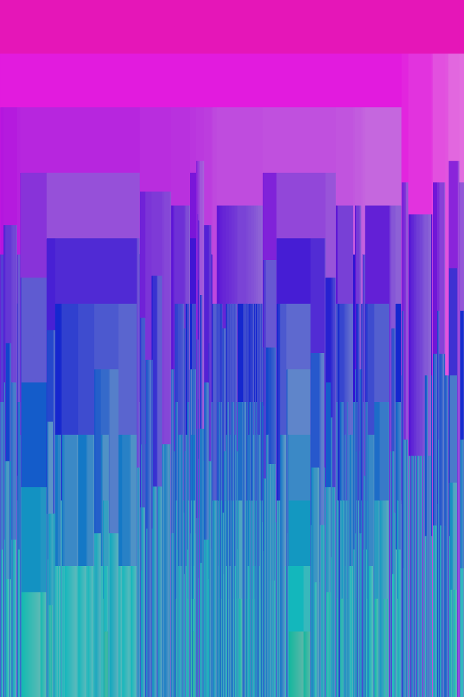
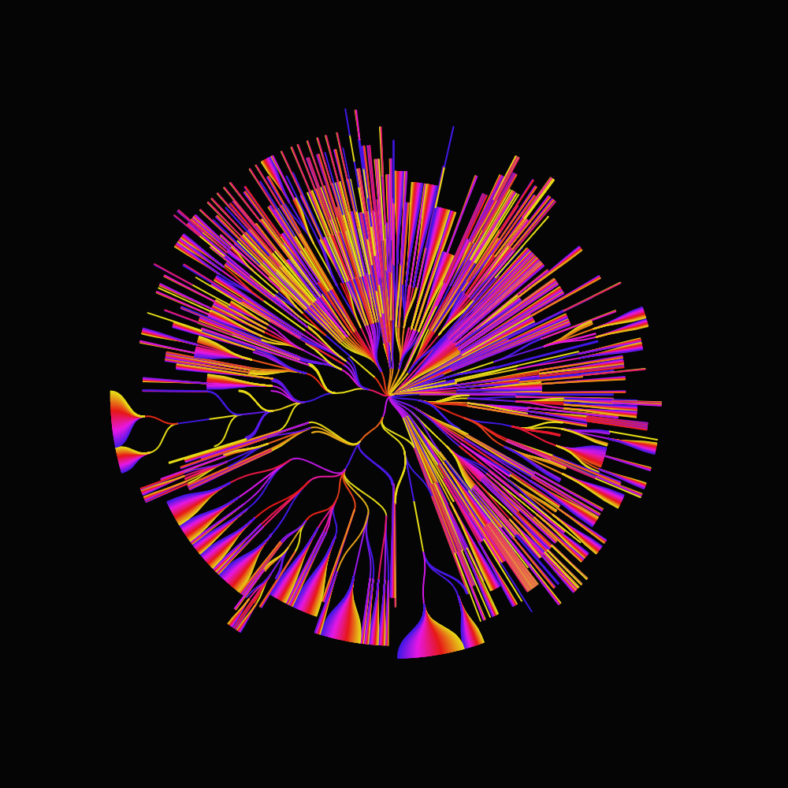
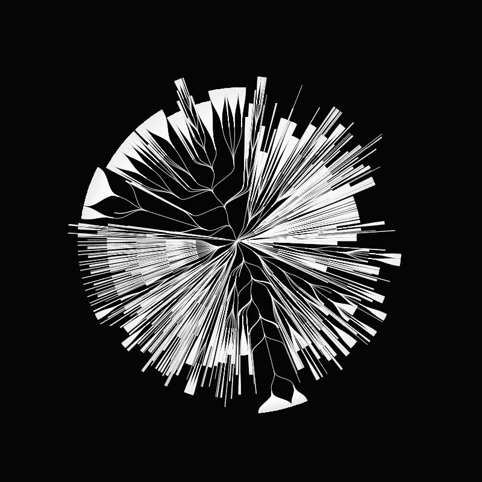
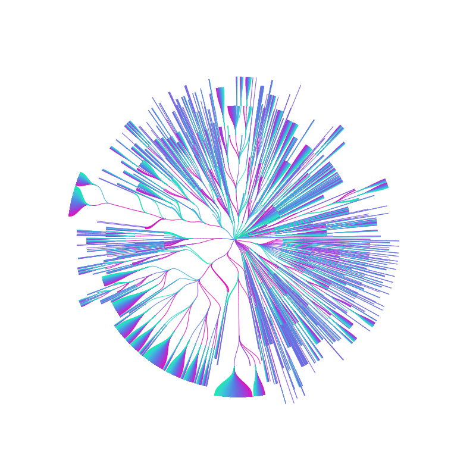

# Repogram

The repogram is a generative visualization of a directory tree. Here, it's the re|thread repo.

## Data

The data is extracted and analyzed with the [``data/tree_extraction.py``](data/tree_extraction.py) script, and stored in the [``data/repo_data.json``](data/repo_data.json) file.

To create or update the JSON file, run ``py tree_extraction.py`` in the ``data`` folder. Python needs to be installed.

## Visualization

There are two visualizations. They represent the same data with the same logic (an animated breadth-first search), but in different shapes. They are web-based, created with [p5.js](https://p5js.org).

In both cases, the order of the directories and files is shuffled (recursively), so that the visualization changes each time the page is loaded: it's generative!

### Rectangular

In the [rectangular](rectangular) version, each directory or file is drawn as one rectangle. All leaves have the same width. Otherwise, the width of a node is the sum of the widths of its children, and the width of the root directory (at the very top) is the width of the visualization. The heights are computed so that the graph fills the whole image vertically, as all leaves reach the bottom.

Live view: [https://rethread.art/code/repogram/rectangular](https://rethread.art/code/repogram/rectangular).

#### URL parameters
- ``lines``: whether we also draw the white tree lines on top (``yes`` or ``no``, default is ``no``)
- ``width``: the width of the image (default is the width of the browser window)
- ``height``: the height of the image (default is the height of the browser window)

#### Examples
- [https://rethread.art/code/repogram/rectangular/?lines=yes&width=1080&height=720](https://rethread.art/code/repogram/rectangular/?lines=yes&width=1080&height=720)

- [https://rethread.art/code/repogram/rectangular/?width=720&height=1080](https://rethread.art/code/repogram/rectangular/?width=720&height=1080)

- In the [circular](circular) version, the data is represented as a circular tree, with the root at its center and leaves on the border.

Live view: [https://rethread.art/code/repogram/circular](https://rethread.art/code/repogram/circular).

#### URL parameters
- ``background``: the color of the background (``white``, ``black`` or ``transparent``, default is ``black``)
- ``color``: whether the lines are multicolored or not (``yes`` or ``no``, default is ``yes``)
- ``width``: the width of the image (default is the width of the browser window)
- ``height``: the height of the image (default is the height of the browser window)

#### Examples
- [https://rethread.art/code/repogram/circular/?width=800&height=800](https://rethread.art/code/repogram/circular/?width=800&height=800)

- [https://rethread.art/code/repogram/circular/?background=white&color=no&width=800&height=800](https://rethread.art/code/repogram/circular/?background=white&color=no&width=800&height=800)

- [https://rethread.art/code/repogram/circular/?background=transparent&color=yes&width=800&height=800](https://rethread.art/code/repogram/circular/?background=transparent&color=yes&width=800&height=800)

